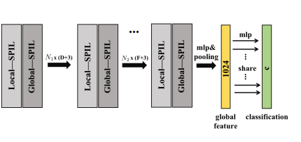

# SPIL (Skeleton-based Point-set Interaction Learning)

SPIL treats the skeleton sequence as a 3D point cloud (x, y, and frame index), allowing for flexible modeling of skeletal interactions without being restricted by a fixed graph topology.

## Key Features

- **Point Cloud Formation**: The feature extractor flattens YOLO keypoint detections into a simple array of points. Each point is a 4D vector: `[x, y, frame_index, confidence]`.
- **Random Sampling**: To maintain a fixed input size for the model, a specific number of points (e.g., 1024 or 2048) are selected randomly from the extracted set.

## SPIL layer

To obtain a distinguishable representation ability to capture the correlation between different skeletal points, it is necessary to consider both feature similarity and position characteristic relation. The authors separately explore the feature and position information and then perform high-level modeling of them to dynamically adapt to the structure of the objects.

$$W_{ij} = \Phi(R^F(p^f_i ,p^f_j),R^L(p^l_i,p^l_j))$$

where:

- $p^f_i$: C-dim vector of features for a point $i$ (confidence, joint).
- $p^l_i$: 3-dim vector of coordinates for a point $i$ ($x, y, \text{frame}$).
- $R^F$: **Feature term**
  $R^F(p^f_i ,p^f_j) = \phi(g(p^f_i)^T \theta(g(p^f_j)))$
  $\phi(\cdot)$ and $\theta(\cdot)$ are two learnable linear projection functions, followed by ReLU.
- $R^L$: **Position Term**
  $R^L(p^l_i, p^l_j) = 0 \text{ if } D_{l^z_i=l^z_j}(p^l_i, p^l_j) > d \text{ else } \psi(M_1(p^l_i) \parallel M_2(p^l_j))$
  $M_1(\cdot)$ and $M_2(\cdot)$ are two multilayer perceptrons functions and $\psi(\cdot)$ is a linear projection function followed by ReLU.

  To combine multi-head weights, in this work, we employ
  the concatenation fusion function. We can extend Eq(7) as:
  $$X^{(l+1)} = H\parallel_{\iota}(W_{\iota}X^{(l)}M_{\iota}^{(l)}, \text{dim} = 1)$$

Local-SPIL and Global-SPIL modules which perform information
propagation based on assigning different weights to different skeleton points

## Component Task

1. **Generator**: Handles sampling and provides point cloud batches.
2. **Feature Extractor**: Flattens YOLO predictions and formats them into a 3D point cloud.
3. **Model**: A point-based architecture using the SPIL layers to capture dynamic interactions.

## Original paper

[Link](https://arxiv.org/pdf/2308.13866)
