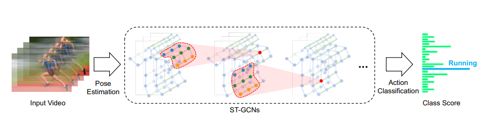

# STCGN (Spatial-Temporal Graph Convolutional Network)

The STCGN module processes skeleton data as a dynamic graph, capturing both the human anatomy (spatial) and the movement over time (temporal).

## Key Features

- **Graph Generation**: The feature extractor converts YOLO prediction arrays into a graph structure.
- **Temporal Tracking**: To track individuals across frames, the system uses **Euclidean distance** as a one-to-one measure between joints of persons in consecutive frames. This ensures that the temporal edges in the graph correctly connect the same joints of the same person over time.
  

In the `model.py -> ST_GCN` function can be observed the architecture of the model. with a parameter `num_gcn_layers=2` it is possible to change the number of GCN layers. in orther to change the number of convolutional layers in the time and spatial domain, for simplicity we have used the same number of convolutional layers for both but can be change to allow gather more information in the temporal or spatial domain. the number of nodes is determined by the number of frames by person in the batch. the number of edges is determined by the number of limbs and temporal connections by person in the batch.

## Graph Structure

- **Nodes**: Represent individual joints (x, y coordinates and confidence).
- **Spatial Edges**: Connect joints within the same frame according to human anatomy (e.g., shoulder to elbow).
- **Temporal Edges**: Connect the same joint across consecutive frames for the same tracked individual.

## Component Task

1. **Generator**: Manages batching and provides graph samples to the training process.
2. **Feature Extractor**: Uses YOLOv11-pose to detect keypoints and builds the graph using the tracking logic described above.
3. **Model**: A Graph Neural Network (implemented with `tensorflow-gnn`) that performs classification on the `GraphTensor`.

### Original paper

[Link](https://arxiv.org/pdf/1801.07455)
